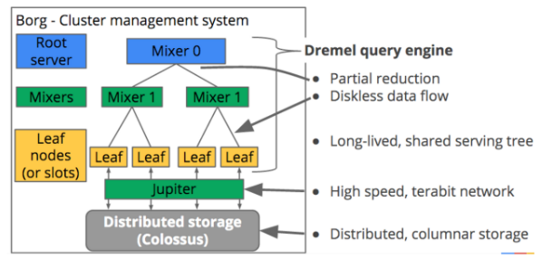
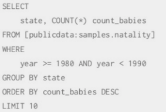
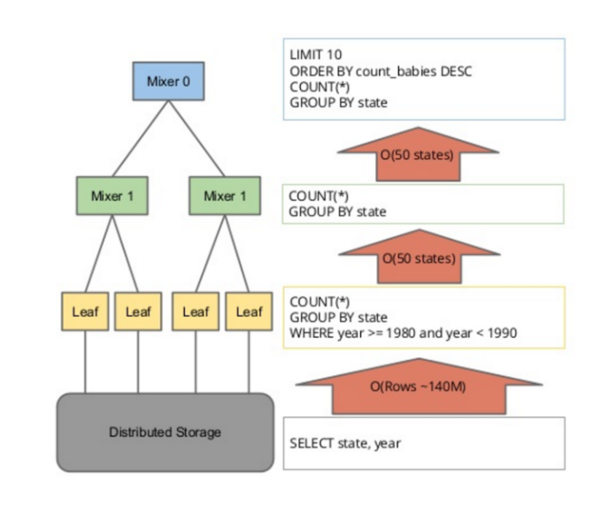

# BigQuery란.. 
> 빅 쿼리 구조를 알기 전에 빅쿼리를 만든 이유에 대해서 알면 구조를 이해하는 데 이해가 쉽다. 
<b><U>실시간 빅 데이터 분석을 위한 분산 스토리지</U></b>를 만들기 위해서 구글이 설계한 클라우드 스토리지 시스템이다.

AI, LLM 이 오면서 서비스 입장에서 헤엄쳐야 하는 바다의 규모가 광안리 해수욕장에서 태평양 사이즈로 넓어졌다. 이제는 검색엔진에서 원하는 solution을 가져오기 위해서 광안리 해수욕장 해변가 카페에 들러서 아메리카노를 사서 서핑 대여소에서 서핑 보드를 가져오는 것이 아니라 하와이에서 파인애플이 들어간 햄버거를 먹으면서 괌에 있는 유적지에 구경을 하는 셈이다. 

서비스 사용자는 이러한 투어를 하루 일정 안에 넣고 싶어한다. 그렇기 때문에, 기존의 모터 보트로 이동하기 보다는 f35를 타고 여행을 해야 하는 셈이다(<b> 기술이 발전했기 때문에 ㅠㅠ</b>).

그러기 위해서 구글이 만들어낸 클라우드 서비스로, 마케팅 슬로컨으로 내 건 Petabyte 단위를 몇 분 이내로 SEARCH 해오는 데이터 웨어하우스다. 즉, 데이터 웨어하우스계의 쿠팡인 셈이다.
1

### ANSI Query
가장 많이 사용되고 보편화된 ANSI Query문을 사용한다. postGre에서 사용되던 그지갔던 테이블 쌍 따옴표가 없어서 너무나도 행복하다.

### SELECT 메커니즘

기존의 SQL은 키 값을 가져와 행을 읽어들이는 메커니즘을 가지고 있다. 즉, 다음과 같은 테이블이 있다면

*  A | B | C
* D | E | F
* G | H | I

이렇게 됐을 때, 해당 테이블에서 해당 테이블 중 D 값을 키값으로 전송했을 때 다음과 같은 문자열로 전송이 될 확률이 높다. 
> D;E;F;

빅 SQL 같은 경우 다르다. 빅 SQL의 특징으로는 다음과 같은 것들이 있다.

### NO-KEY,NO-INDEX (FULL SCAN ONLY)
> 빅 쿼리에서는 위와 같이 키로 행을 가져온다거나 인덱스로 테이블을 구별하는 작업이 없다.

실제 데이터를 처리하는 방식은 다음과 같이 트리 구조를 통해서 데이터를 처리한다.

### 다음과 같은 sql 문이 있다고 한다면

### Big Query는 특정 SQL 문에서 각 구문 별로 node, mixer 를 단계별로 거쳐가면서
사용자가 입력한 구문에 따라 테이블 값이 정제되서 나온다.

### 전체 조회
기존의 방식은 SELECT문을 통해서 행, 열을 기반으로 쿼리를 조회했다면 이전에 말했듯이 키와 인덱스가 없는 빅쿼리에서는 FULL scan을 통해서 조회가 이루어진다. 막강한 컴퓨팅 능력과 트리 구조를 기반으로 input 스트림에 제약 없이 처리함에 따라 빅데이터 처리에 엄청난 성능을 보장하는 것은 사실이다. 하지만, 많은 양의 데이터에서 일부 데이터만 조회하는 시스템에서 <b>요금이 과하게</b> 청구될 수 있다는 단점이 있다.

### partition
데이터의 관리를 위해서 빅쿼리에서 등장하는 분할 방식이다. 이전에, 말했듯이 빅쿼리는 풀스캔으로 돌아가기 떄문에 선택한 영역을 전부 조회하게 된다. 그렇기 떄문에, 다음과 같이 partition을 설정하게 되면, 해당 영역만 full scan을 할 수 있기 때문에 파티션 설계만 잘 할 수 있다면 어마어마한 컴퓨팅 능력과 적은 데이터를 낮은 비용으로 추출할 수 있다. 

#### Partition option
* expiration time: 파티션 수명 기간. 파티션이 너무 오래 살아 있다면, 배치 또는 스케줄에서 있는 옵션으로 지속적으로 청구될 수 있기 때문에 기한이 필요한 데이터들에 대해서는 유효한 기능이다.
* 특정 partition에 write 기능 적용: loading 작업을 다른 파티션에 영향을 주지 않고 작업할 수 있다.
* 특정 partition만 delete 기능 적용: 빅쿼리의 단점 중 하나로, delete 영역 적용 시 모든 영역을 삭제하게 된다. partition의 옵션을 잘 조정한다면 table의 특정 영역만 삭제가 가능하다.

> 다음과 같은 상황일 떄는, 파티션보다는 클러스터링 적용을 더 추천한다.
* 파티셔닝 보다 더 세밀한 영역으로의 조회가 필요할 경우
* 여러 개의 컬럼을 대상으로 통합과 필터가 이루어지는 쿼리가 포함되었을 경우
* 컬럼에서의 cardinality가 독보적으로 많을 경우
* query 실행 시 strict한 정책으로 돌아가지 않는 서비스
* 파티션을 진행할 때마다 해당 파티션을 지칭하는 메타데이터가 생성되는데, 재사용성이 높지 않은 파티셔닝으로 구성된 테이블은 지양
* 파티션 테이블의 크기를 넘어서는 양의 파티션을 가지는 데이터베이스
* 대부분의 파티션에 영향을 미치는 DML 기능을 작용하는 서비스
> 다음과 같은 경우일 경우 클러스터링을 활용한 테이블을 사용하는 것이 훨씬 더 효율적이다.

## 파티션의 종류
정수 컬럼에서는 특정 범위에서 

#### preuning
https://cloud.google.com/bigquery/docs/querying-partitioned-tables
여기 공부 필요