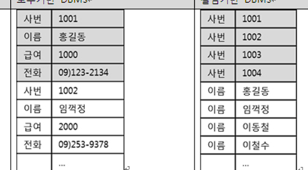

 ### 컬럼형 기반으로 데이터를 불러오는 방식의 DBMS

 #### 특징:
 
  우측이 컬럼 기반

 * 컬럼 단위로 데이터를 저장
 * 컬럼별로 파일이 생성되고 디스크 페이지에는 동일한 페이지에는 컬럼 값들이 연속됨
 * 동일한 컬럼에 대해 대량으로 데이터를 처리할 때 적합
 * 컬럼값 보다는 <b><u>중복된 값이 많으므로 압축효율이 높음

 * 주로 분석용 데이터베이스에서 빠르게 데이터를 추출하기 위한용도로 많이 사용됨
 
  
 

